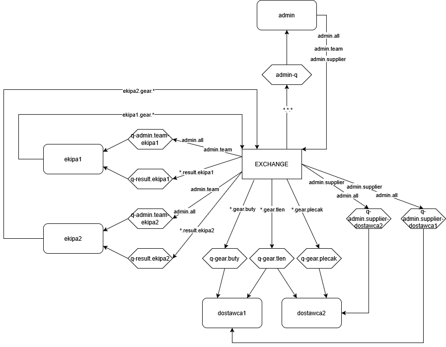

1. `docker run -it --rm --name rabbitmq -p 5672:5672 -p 15672:15672 rabbitmq:4-management`
2. `python .\admin.py`
3. `python .\team.py ekipa1`
4. `python .\team.py ekipa2`
5. `python .\supplier.py dostawca1 tlen 2 buty 3`
6. `python .\supplier.py dostawca2 plecak 5 tlen 1`

